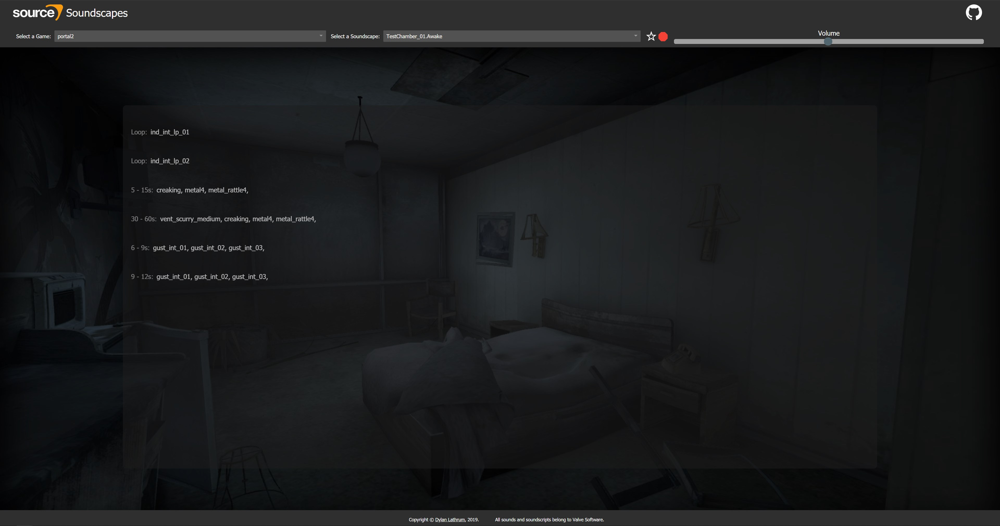

# *IMPORTANT*

If (re)installing node_modules, copy `node_modules.babel-plugin-wildcard.lib.index.js` to `node_modules/babel-plugin-wildcard/lib/index.js` and replace the file that is there!
This depends on a PR made by `louislva` [here](https://github.com/vihanb/babel-plugin-wildcard/pull/33) which has not yet been merged to master. If the fork is added to the project however, npm (for some reason) fails to compile the plugin into the file found in the lib directory. As such, the new code must be put in manually.

# Source-Soundscapes

Source-Soundscapes is a website that plays [source engine soundscapes](https://developer.valvesoftware.com/wiki/Soundscape) in a webbrowser. The app currently supports over *2300* soundscapes from the following games:
- Alien Swarm
- Counter-Strike: Global Offensive
- Counter-Strike: Source
- Day of Defeat: Source
- Half-Life 2
- Half-Life 2: Episode 1
- Half-Life 2: Episode 2
- Half-Life 2: Deathmatch
- Half-Life 2: Lost Coast
- Left 4 Dead 2
- Portal
- Portal 2
- Team Fortress 2

## How to run

Either grab the latest compile release from the [releases](https://github.com/Dylancyclone/source-soundscapes/releases), or grab the `sounds.7z` archive from the [releases](https://github.com/Dylancyclone/source-soundscapes/releases).

To just run the website, clone the repo, install all dependencies with `yarn install`, extract the sounds from `sounds.7z` into `./public/sound/`, and run `yarn start`.

To compile an optimized build, run `yarn build`. If the sounds have been copied into the `./public` folder, this process might take awhile because it needs to copy all the sounds to the `./build` folder. If you haven't yet extracted the files, you can just compile the optimized build first and then extract the sounds into `./build/sound/`. This will be faster than waiting for node to copy the files if you just want the compiled build.

## Possible future updates

While I consider this project to be completed, there are a couple things that would be nice to have such as:

- [ ] Mute Channel
- [ ] Smart Random Sounds

## Contributing
Pull requests are welcome. For major changes, please open an issue first to discuss what you would like to change.

## License
[MIT](https://choosealicense.com/licenses/mit/)

All sounds, soundscripts and content displayed in background images belong to Valve Software, I do not claim any ownership over them.